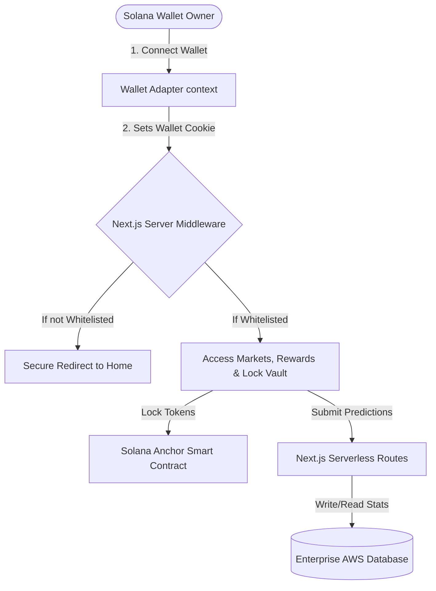

# Golden Goal: Solana Decentralized Sports Prediction Economy

<p align="center">
  
  
  
  
  
  
</p>

Golden Goal is a premium, next-generation Web3 sports prediction ecosystem designed to merge high-fidelity gamification, zero-capital forecasting, and sports oracle data feed pipelines on the Solana blockchain.

By establishing a **sustainable prediction economy**, users make risk-free forecasts on global fixtures (such as World Cup matches) completely free, accumulate Experience Points (XP) for analytical accuracy, and win high-yielding rewards from weekly token prize distributions.

---

## 🌟 Core Pillars

### 🎯 Zero-Capital Forecasting
Users utilize token locking limits or wallet hold quotas to predict. Core assets remain 100% untouched and secure inside their own wallets.

### 🎁 Rewards Box Module
A provably fair gamified loyalty module. Unlocks daily free boxes and dynamic point multipliers based on user locking tiers.

### 🛡️ VIP Token Locking
Locking `$GG` tokens reduces circulating supply while unlocking premium prediction quotas, XP point multipliers, and deep rewards chest discounts.

### 📊 Dual Leaderboards
Separate ranking structures rewarding competitive excellence: a **Pro Forecasters** leaderboard for match accuracy, and a **Social Leaderboard** for community advocacy and viral outreach.

---

## 🏗️ Architecture Overview

The system is deployed using high-performance serverless endpoints backed by enterprise-grade AWS database clusters and protected by a robust server-side whitelist gatekeeper.



---

## 📁 Repository Structure

```
├── program/             # Solana Anchor smart contracts (Rust)
│   ├── src/lib.rs       # Golden Goal Token Lock Vault program
│   └── Anchor.toml      # Anchor workspace configuration
├── src/
│   ├── app/             # Next.js page components & serverless API routes
│   │   ├── api/lock/    # Locking API validation handlers
│   │   ├── api/unlock/  # Unlocking API validation handlers
│   │   └── rewards/     # Staking, Reward Box, and Social Tasks pages
│   ├── components/      # UI components (Header, CustomModal, etc.)
│   ├── lib/
│   │   ├── db.js        # Postgres database configurations & migrations
│   │   └── whitelist.ts # strictly-typed whitelist validation utility
│   └── middleware.js    # Server-side Whitelist matcher & gatekeeper
├── tsconfig.json        # Next.js TypeScript configurations
└── README.md            # Repository documentation
```

---

## ⚙️ Local Development

### Prerequisites
- Node.js (v18 or higher)
- Rust & Solana CLI (for Smart Contract compiles)
- Anchor Framework (v0.29 or higher)

### Setup

1. **Clone the repository:**
   ```bash
   git clone https://github.com/goalgolden2026-hub/Golden-Goal.git
   cd Golden-Goal
   ```

2. **Install dependencies:**
   ```bash
   npm install
   ```

3. **Configure Environment Variables:**
   Create a `.env.local` file inside the root directory:
   ```env
   POSTGRES_URL="your-postgresql-connection-string"
   NEXT_PUBLIC_ADMIN_WALLET="your-admin-wallet-address"
   ```

4. **Run the development server:**
   ```bash
   npm run dev
   ```

5. **Build the production bundle:**
   ```bash
   npm run build
   ```

---

## 🔒 Security Compliance

Golden Goal enforces strict security controls:
- **Server-Side Verification**: Route authorization is executed at the Next.js server middleware level, preventing DevTools client-side bypasses.
- **Vulnerability Disclosures**: We follow a private responsible disclosure channel. See our [SECURITY.md](SECURITY.md) for reporting vulnerabilities.

## 📄 License
This project is licensed under the MIT License. See the [LICENSE](LICENSE) file for details.
