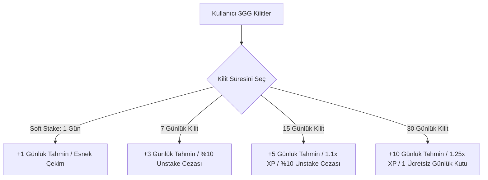

# Golden Goal ($GG) Whitepaper
*Solana Üzerinde Merkeziyetsiz, Oyunlaştırılmış Spor Tahminleri ve Sosyal Kehanet Merkezi*

**Sürüm:** 1.2.0  
**Yayınlanma Tarihi:** Mayıs 2026  
**Resmi Platform Alan Adı:** [www.goldengoalsol.com](https://www.goldengoalsol.com)  

---

## 1. Giriş

Solana Golden Goal; tahmin oyunlarını, staking'i, sosyal etkileşimi ve rekabetçi ödülleri tek bir çatı altında birleştiren yeni nesil bir Web3 futbol tahmin platformudur.

Golden Goal'ün birincil amacı; futbol tutkunlarının herhangi bir finansal risk almadan ücretsiz tahminler yapabildiği, Deneyim Puanları (XP) kazanabildiği ve haftalık yüksek değerli token ödülleri için rekabet edebildiği sürdürülebilir, topluluk odaklı bir tahmin ekonomisi kurmaktır. Golden Goal, Solana blokzincirinin yüksek hızından ve düşük maliyet verimliliğinden yararlanarak, pasif spor taraftarları ile aktif DeFi/Web3 topluluğu arasındaki köprüyü oluşturmaktadır.

Platform; üst düzey bir kullanıcı deneyimi sunmak amacıyla oyunlaştırma mekaniklerini, güçlü staking araçlarını, viral referans büyüme programlarını ve tamamen adil ödül sistemlerini entegre eder.

---

## 2. Vizyon

Golden Goal'ün vizyonu; dünyanın en büyük futbol tahmin ve taraftar etkileşim platformunu inşa etmektir.

Bu hedefe ulaşmak için platform, kullanıcılarına aşağıdaki imkanları sunar:
*   **Ücretsiz Tahminler Yapma:** Herhangi bir finansal risk taşımadan gerçek dünya futbol maçlarının sonuçlarını tahmin etme.
*   **Haftalık Liderlik Tablolarında Rekabet:** İsabetli tahminler yaparak üst sıralara yükselme ve haftalık ödüller kazanma.
*   **Staking Avantajları:** Token kilitleyerek pasif avantajlar, tahmin çarpanları ve sadakat ödül indirimleri kazanma.
*   **Sosyal Görevlerle Kazanma:** Platformun sosyal medyada viral büyümesine yardımcı olarak topluluk ödülleri elde etme.
*   **Sürdürülebilir Ekosisteme Katılım:** Deflasyonist token yakım mekanizmaları ve sürekli beslenen ödül havuzlarıyla korunan dengeli bir ekonominin parçası olma.

---

## 3. Sorun & Çözüm

### 3.1 Sorun
Geleneksel spor tahmini ve bahis platformları, sektör genelinde kronikleşmiş bazı ciddi kusurlara sahiptir:
1.  **Yüksek Finansal Risk:** Taraftarlar, spor analiz yeteneklerini test etmek ve sürece dahil olmak için bile kendi birikimlerini riske atmak zorunda kalırlar.
2.  **Karmaşık Kullanıcı Deneyimi:** Karışık bahis kuponları, gizli komisyonlar ve zorlu kayıt süreçleri kripto dışı kitlelerin sisteme dahil olmasını engeller.
3.  **Zayıf Topluluk Etkileşimi:** Kullanıcılar birbirlerinden bağımsız, izole tahminlerde bulunurlar; platformlarda sosyal unsurlar, viral döngüler veya ortak topluluk ödülleri bulunmaz.
4.  **Düşük Token Faydası:** Mevcut spor token'larının büyük kısmı somut platform faydasından yoksun, tamamen spekülatif niteliktedir.
5.  **Yüksek Giriş Bariyerleri:** Eski blokzincirlerdeki yavaş işlemler ve yüksek işlem ücretleri kitlesel pazarın katılımını zorlaştırır.

### 3.2 Çözüm
Golden Goal, bu sorunları modern Web3 mimarisiyle çözer:
*   **Risksiz Tahmin Sistemleri:** Kullanıcılar ana varlıklarını riske atmadan gerçek dünya futbol karşılaşmalarında analiz becerilerini yarıştırır.
*   **Derin Staking Faydası:** Token sahipliği ve staking, platform içi doğrudan avantajlara (ek kota, XP çarpanı vb.) dönüşür.
*   **Oyunlaştırılmış Sosyal Etkileşim:** Twitter Farming ve Ödül Kutusu (Rewards Box) gibi özellikler, tahmin sürecini sosyal olarak paylaşılan eğlenceli bir deneyime dönüştürür.
*   **Referans Büyüme Sistemi:** Arayüze doğrudan entegre edilmiş, organik büyümeyi teşvik eden kulaktan kulağa pazarlama teşvikleri.
*   **Haftalık Liderlik Tablosu Ödülleri:** Topluluktaki en iyi analitik beyinlere doğrudan, şeffaf token dağıtımları.

---

## 4. Platform Özellikleri

### 4.1 Ücretsiz Tahmin Sistemi
Kullanıcılar, Dünya Kupası gibi büyük uluslararası turnuvalar da dahil olmak üzere gerçek dünya futbol maçlarına tahminler yerleştirebilirler.
*   **Tahmin Piyasaları:** Maç Sonucu (1X2), Toplam Gol (Alt/Üst), Karşılıklı Gol Var/Yok, İlk Yarı Sonucu, İlk Golü Kim Atar ve Çifte Şans gibi popüler standart pazarlar.
*   **Risksiz Tahmin Mekaniği:** Tahminler tamamen ücretsizdir. Günlük tahmin limitleri kullanıcının Staking kademesine göre belirlenir.
*   **Kazanılan Ödüller:** Doğru tahminler kullanıcılara şunları kazandırır:
    *   **Deneyim Puanı (XP):** Haftalık liderlik tablosundaki sıralamayı yükseltir.
    *   **Sosyal Puanlar:** Sosyal görev seviyelerine katkıda bulunur.
    *   **Liderlik Tablosu Puanı:** Haftalık ödül havuzundaki payı doğrudan etkiler.
*   **Dinamik Değişiklik:** Kullanıcılar kişisel kontrol panelleri üzerinden, maçın başlama saatine 5 dakika kalana kadar tahminlerini değiştirebilir veya iptal edebilirler.

### 4.2 Haftalık Ödül Havuzu
Golden Goal'ün rekabetçi kalbi haftalık Liderlik Tablosudur. Her hafta, liderlik tablosundaki en başarılı ilk 10 tahminci **Golden Goal ($GG) tokenları** ile ödüllendirilir.

Ödül dağıtımı aktif kullanıcı hacmine, tamamlanan fikstürlere ve hazine gelirlerine göre dinamik olarak ölçeklenir; böylece en iyi analiz yeteneğine sahip 10 kullanıcı sürekli olarak premium kazançlarla teşvik edilir. Güncel ödül miktarları ve dağılımları her maç haftasının başında şeffaf bir şekilde kontrol panelinde sergilenir. Bu esneklik, Dünya Kupası gibi küresel şampiyonalarda ödül havuzlarının çok daha yüksek seviyelere çıkarılmasına olanak tanır.

---

### 4.3 VIP Analiz Paneli (Dashboard)
Her katılımcı, şu analitik verileri barındıran premium bir kişisel panele erişebilir:
*   **Toplam Puan & Aktif Tahminler:** Aktif tahmin durumlarının anlık görünümü.
*   **Başarı Oranı (WR):** Tüm tahmin kategorilerindeki tarihsel başarı yüzdesi.
*   **Tahmin Geçmişi:** Geçmiş tüm tahminlerin, kazanılan puanların ve kesinleşen maç skorlarının şeffaf dökümü.

---

### 4.4 Staking Sistemi
Uzun vadeli sadakati teşvik etmek, token talebini artırmak ve dolaşımdaki arzı dengelemek için Golden Goal kademeli bir staking protokolü uygular.



*   **Soft Stake (Esnek Kilitleme):**
    *   *Minimum:* 100 $GG token
    *   *Kilit Süresi:* 1 Gün
    *   *Ödül:* Günlük +1 ek tahmin limiti
    *   *Çekim:* Sıfır ceza ile tamamen esnek çekim.
*   **7 Günlük Stake:**
    *   *Minimum:* 500 $GG token
    *   *Kilit Süresi:* 7 Gün
    *   *Ödül:* Günlük +3 ek tahmin limiti
    *   *Erken Çekim Cezası:* Kilit süresi dolmadan çekim yapıldığında ana paradan %10 kesinti.
*   **15 Günlük Stake:**
    *   *Minimum:* 1,000 $GG token
    *   *Kilit Süresi:* 15 Gün
    *   *Ödüller:* Günlük +5 ek tahmin limiti & **1.1x XP Çarpanı**
    *   *Erken Çekim Cezası:* Kilit süresi dolmadan çekim yapıldığında ana paradan %10 kesinti.
*   **1 Aylık Stake (Tier 4):**
    *   *Minimum:* 5,000 $GG token
    *   *Kilit Süresi:* 30 Gün
    *   *Ödüller:* Günlük +10 ek tahmin limiti, **1.25x XP Çarpanı** ve sadakat modülünde **Her Gün 1 Ücretsiz Ödül Kutusu**.

---

### 4.5 Staking Yakım Mekanizması
Kilit süresi dolmadan erken token çekimlerinde uygulanan **%10 ceza ücreti**, uzun vadeli token ekonomisini ve ödül sürdürülebilirliğini korumak amacıyla ikiye bölünür:
*   **%50'si kalıcı olarak yakılır (Burn):** Dolaşımdaki token arzı doğrudan azaltılarak deflasyonist baskı oluşturulur.
*   **%50'si Ödül Havuzu Cüzdanına aktarılır:** Gelecek haftalardaki liderlik tablosu ödüllerini finanse etmek amacıyla doğrudan ekosisteme geri kazandırılır.

---

### 4.6 Ödül Kutusu (Rewards Box)
Ödül Kutusu, kullanıcıların sadakat ödülleri, devasa XP puanları veya ek tahmin limitleri kazanmasını sağlayan yüksek etkileşimli bir oyunlaştırma modülüdür. Kutu açımları tamamen XP Puanları ile gerçekleştirilir ve Staking kademelerine göre büyük indirimlerle sunulur:

| Kullanıcı Kategorisi | Staking Durumu | Kutu Açım Maliyeti (XP) |
2: | :--- | :--- | :--- |
| **Kilit Yapmayanlar (Tier 0)** | 0 $GG veya aktif staking bulunmayan cüzdanlar | 100 XP |
| **1 Günlük Stakerlar (Tier 1)** | Aktif Soft Stake | 75 XP |
| **7 Günlük Stakerlar (Tier 2)** | Aktif 7 Günlük Kilitli Stake | 50 XP |
| **15 Günlük Stakerlar (Tier 3)** | Aktif 15 Günlük Kilitli Stake | 25 XP |
| **1 Aylık Stakerlar (Tier 4)** | Aktif 30 Günlük Kilitli Stake | **Her Gün 1 Kutu ÜCRETSİZ**, sonrakiler 25 XP |

**Ödül Kutusundan Çıkabilecek Olası Ödüller:**
*   Liderlik sıralamasında yükselmenizi sağlayacak XP Puanları (+100, +250, +500, +1000 XP).
*   Yoğun fikstürlü haftalarda kullanabileceğiniz ek günlük tahmin kotaları (+1 ile +5 arası ek kota).

---

### 4.7 Referans Sistemi
Referans sistemi, platformun organik büyümesini tetikler. Kullanıcılar kendilerine özel bağlantılarla yeni katılımcıları platforma davet ederek Referans Puanları kazanırlar.
*   **Doğrulama Kuralı (Spam/Bot Koruması):** Davet edilen bir kullanıcının referans olarak sayılabilmesi için Solana cüzdanını bağlaması ve platform üzerinde en az **bir aktif işlem** gerçekleştirmesi (tahmin kilitleme, stake etme veya kutu açma) zorunludur.
*   **Ödüller:** Belirli referans sınırlarına ulaşan kullanıcılar özel token bonusları ve ücretsiz yüksek kademe Ödül Kutusu açımları elde ederler.

---

### 4.8 Sosyal Görevler (Twitter Farming)
Sosyal medyada sürekli görünürlük sağlamak amacıyla Golden Goal, viral topluluk pazarlamasını ödüllendirir:
*   **Twitter Farming:** Kullanıcılar X (Twitter) platformunda resmi `#GoldenGoal` etiketiyle paylaşım yapıp bu tweet URL'sini sisteme girdiklerinde anında **25 Sosyal Puan** kazanırlar.
*   **Sosyal Liderlik Tablosu:** Sadece sosyal paylaşımlardan ve referanslardan kazanılan Sosyal Puanların yarıştığı özel bir liderlik tablosudur ve en aktif pazarlamacılara ek token ödülleri dağıtır.

---

## 5. Token Faydası (Utility)

Platformun temel taşı olan **Golden Goal ($GG)** tokenı, tüm ekosistem boyunca derin işlevsel faydalara sahiptir:
1.  **Staking:** VIP çarpan seviyelerini, günlük ekstra tahmin limitlerini ve özel platform imtiyazlarını aktifleştirme.
2.  **Kutu Açma Avantajı:** Staking kademelerine bağlı olarak Ödül Kutusu açımlarında devasa XP indirimleri veya günlük ücretsiz açım hakları.
3.  **Ekosistem Ödülleri:** Liderlik tablosundaki en başarılı analizcilere haftalık olarak yapılan ödemelerin para birimi olması.
4.  **XP ve Puan Artırıcılar:** Liderlik sıralamasında avantaj elde etmek için XP çarpanları satın alma.
5.  **Ekosistem Yönetişimi (DAO):** Token sahiplerine topluluk cüzdanı harcamaları ve ekosistem genişleme öncelikleri üzerinde oylama gücü verme.
6.  **Gelecek Turnuva Katılımları:** Yüksek ödüllü sezonluk özel tahmin turnuvalarına katılım bileti olma.

---

## 6. Sürdürülebilir Tokenomics & Adil Lansman

### 6.1 Token Sürdürülebilirliği Mekanizmaları
Golden Goal token ekonomisi, enflasyona dayalı olmak yerine ekosistem içi sürekli fayda ve yakım (sink) mekanizmalarıyla dengelenir:
*   **Erken Unstake Cezaları:** Süresi dolmadan yapılan kilit iptali cezalarının %50'si kalıcı olarak yakılarak dolaşımdaki arzdan silinir.
*   **Ödül Kutusu Katkıları:** Kutu açımlarından elde edilen gelirlerin bir kısmı ekosistem havuzunu beslemek üzere hazineye aktarılır.
*   **Deflasyonist Mikro Ücretler:** Tahmin değiştirme ve iptallerinden alınan mikro token kesintileri sürekli deflasyonist etki yaratır.

### 6.2 Adil Lansman (Kilitli veya Ön Satış Tokenı Yoktur)
Golden Goal, topluluk öncelikli bir protokol olarak tasarlanmıştır. Mutlak güven ortamını sağlamak amacıyla:
*   **Ön Satış Yoktur:** Platform öncesinde herhangi bir halka açık ön satış etkinliği yapılmamıştır.
*   **Kilitli Token Baskısı Yoktur:** Ekosistem üzerinde gelecekte pazara sürülerek fiyata baskı yapacak **önceden rezerve edilmiş ön satış veya kurucu kilitli token programı yoktur**. Bu durum, dolaşımdaki tüm tokenların yalnızca aktif katılımcıları, gerçek oyuncuları ve uzun vadeli stakerları temsil etmesini sağlayarak yapay satış baskılarını tamamen ortadan kaldırır.

---

## 7. Altyapı, Güvenlik & Adil Oyun

### 7.1 Enterprise AWS Sunucu Altyapısı
%99.99 çalışma süresi (uptime), ultra düşük gecikme süresi ve Dağıtık Hizmet Reddi (DDoS) saldırılarına karşı üst düzey savunma sağlamak amacıyla Golden Goal'ün tüm çekirdek mimarisi **Amazon Web Services (AWS)** üzerinde barındırılmaktadır.
*   **İzole VPC Mimarisi:** Platformun sunucuları ve backend servisleri; veri güvenliğini en üst düzeye çıkarmak için özel alt ağlar (private subnets), gelişmiş güvenlik duvarı kalkanları ve katı rol tabanlı erişim denetimleri içeren yüksek güvenlikli bir AWS Sanal Özel Bulut (VPC) içinde konuşlandırılmıştır.
*   **Güvenli Dağıtık Veritabanı:** Kullanıcı hesapları, tarihsel tahmin verileri ve piyasa durumları, yüksek yedeklilik ve anında otomatik yedekleme özelliklerine sahip enterprise düzeydeki AWS veritabanı altyapılarıyla korunmaktadır.

### 7.2 Adil Oyun Protokolleri
Liderlik tablosu ödüllerinin bütünlüğünü ve adaletini korumak için backend sistemi şu kontrolleri gerçekleştirir:
*   **Bot Önleme Protokolleri:** Gerçek zamanlı kullanıcı hareketlerinin analizi.
*   **Çoklu Hesap (Sybil) Tespiti:** IP adresleri, cüzdan davranışları ve donanım parmak izi izleme mekanizmalarıyla sahte hesap açımlarının engellenmesi.
*   **Spam Filtreleme:** Sosyal görevlerde girilen tweet bağlantılarında katı doğrulama ve hız sınırları.

---

## 8. Yol Haritası (Roadmap)

```
  ┌─────────────────────────────────────────────────────────────┐
  │ AŞAMA 1: Altyapı & Alfa Yayını                              │
  │  ✓ Ana Alan Adı Entegrasyonu (www.goldengoalsol.com)        │
  │  ✓ Premium Sinematik Altın Top Girişi & UI Mimarisi         │
  │  ✓ AWS & Veritabanı Altyapısının Kurulması                  │
  └──────────────────────────────┬──────────────────────────────┘
                                 │
                                 ▼
  ┌─────────────────────────────────────────────────────────────┐
  │ AŞAMA 2: Çekirdek Platformun Devreye Alınması               │
  │  ⏳ Haftalık Rekabetçi Liderlik Tablosunun Aktif Edilmesi    │
  │  ⏳ Viral Sosyal Görevler (Twitter Farming) & Davet Sistemi │
  │  ⏳ Solana Cüzdan Entegrasyonları Suite (Phantom, vb.)      │
  └──────────────────────────────┬──────────────────────────────┘
                                 │
                                 ▼
  ┌─────────────────────────────────────────────────────────────┐
  │ AŞAMA 3: Oyunlaştırma & DeFi Özellikleri                    │
  │  ⏳ Kademeli Staking Protokolü (Soft, 7g, 15g, 30g Kilit)   │
  │  ⏳ Ödül Kutusu (Rewards Box - Sadakat Modülü) Entegrasyonu │
  │  ⏳ Deflasyonist Erken Kilit Açma Ceza Yakımları             │
  └──────────────────────────────┬──────────────────────────────┘
                                 │
                                 ▼
  ┌─────────────────────────────────────────────────────────────┐
  │ AŞAMA 4: Genişleme & Varlıklar                              │
  │  ⏳ Özel Mobil Uygulama Geliştirilmesi ve Yayını            │
  │  ⏳ Sezonluk Büyük Turnuvalar ve Futbol Şampiyonaları       │
  │  ⏳ Oyunlaştırılmış NFT Başarımları & Profil Özelleştirme   │
  └──────────────────────────────┬──────────────────────────────┘
                                 │
                                 ▼
  ┌─────────────────────────────────────────────────────────────┐
  │ AŞAMA 5: Tam Merkeziyetsizlik                               │
  │  ⏳ $GG Tokenı ile DAO Yönetişim Altyapısının Kurulması     │
  │  ⏳ Küresel Spor Dallarına Yayılım (Basketbol, Tenis vb.)   │
  │  ⏳ Espor Tahmin Pazarlarının Entegre Edilmesi              │
  └─────────────────────────────────────────────────────────────┘
```

---

## 9. Feragatname (Disclaimer)

*Golden Goal ($GG), oyunlaştırılmış merkeziyetsiz bir tahmin platformudur. Kripto varlıkları tutmak ve stake etmek piyasa riskleri barındırır. Platformdaki tahmin pazarlarına katılım tamamen eğlence ve puan biriktirme amaçlıdır; kullanıcılar kendi ülkelerindeki yasal düzenlemelere uymakla yükümlüdür. $GG tokenı bir hizmet ve yönetişim tokenı olup; çekirdek geliştirici ekip üzerinde herhangi bir hisse ortaklığı veya borç hakkı temsil etmez.*
