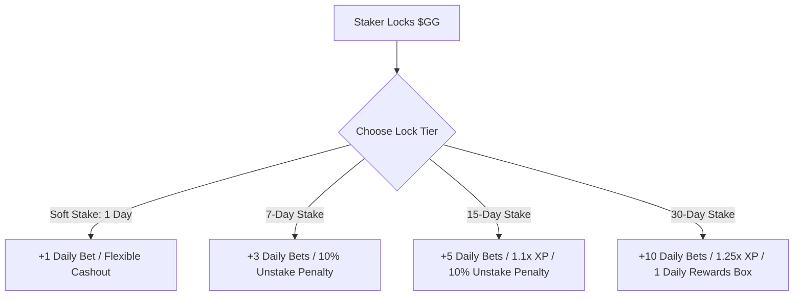

# Golden Goal ($GG) Whitepaper
*Decentralized, Gamified Sports Predictions & Social Oracle Hub on Solana*

**Version:** 1.1.0  
**Release Date:** May 2026  
**Official Platform Domain:** [www.goldengoalsol.com](https://www.goldengoalsol.com)  

---

## 1. Introduction

Solana Golden Goal is a next-generation Web3 football prediction platform that combines prediction gaming, staking, social engagement, and competitive rewards into a single unified ecosystem. 

The primary goal of Golden Goal is to establish a sustainable, community-driven prediction economy where football enthusiasts can predict matches for free, earn Experience Points (XP), and compete for weekly high-value token rewards. By leveraging the speed and cost-efficiency of the Solana blockchain, Golden Goal bridges the gap between passive sports fans and the active DeFi/Web3 community.

The platform integrates gamification mechanics, powerful staking utilities, viral referral growth programs, and provably fair casino-style systems to deliver a premium user experience.

---

## 2. Vision

Golden Goal's vision is to build the world's largest football prediction and fan engagement platform. 

To achieve this, the platform enables users to:
*   **Make Free Predictions:** Predict real-world football fixtures without financial risk.
*   **Compete on Weekly Leaderboards:** Rise through the ranks based on accurate predictions and claim valuable payouts.
*   **Gain Staking Advantages:** Lock tokens to earn passive benefits, prediction multipliers, and casino discounts.
*   **Earn Through Social Tasks:** Help the platform grow virally and get rewarded for community-driven marketing.
*   **Participate in a Sustainable Ecosystem:** Enjoy a token economy built with deflationary burn sinks and continuous rewards.

---

## 3. The Problem & The Solution

### 3.1 The Problem
Traditional sports prediction and betting platforms suffer from several industry-wide flaws:
1.  **High Financial Risk:** Casual fans are forced to risk their hard-earned money just to participate in sports forecasting.
2.  **Complicated User Experience:** Complex betting slips, hidden margins, and difficult onboarding prevent non-crypto users from entering the market.
3.  **Weak Community Engagement:** Users bet in isolation; platforms lack viral loops, social elements, or collaborative community rewards.
4.  **Low Token Utility:** Most existing prediction tokens serve purely speculative purposes, lacking concrete utility sinks or deflationary mechanisms.
5.  **High Onboarding Barriers:** Opaque web interfaces and high gas fees on legacy blockchains alienate the mass market.

### 3.2 The Solution
Golden Goal addresses these issues through a modern, web-scale Web3 architecture:
*   **Risk-Free Prediction Systems:** Users predict real-world football matches without losing their core assets.
*   **Deep Staking Utility:** Holding and staking tokens directly translates to platform perks, eliminating pure speculation.
*   **Gamified Social Engagement:** Features like Twitter Farming and the Lucky Spin turn prediction tracking into a thrilling, socially shared experience.
*   **Referral Growth Systems:** Organic word-of-mouth incentives built directly into the UI.
*   **Weekly Leaderboard Rewards:** Direct, transparent financial distributions to the best analytical minds in the community.

---

## 4. Platform Features

### 4.1 The Free Prediction System
Users can place predictions on real-world football fixtures, including major international tournaments like the World Cup.
*   **Prediction Markets:** Outright Match Winner (1X2), Exact Score Outcomes, and overall Team Performances.
*   **Risk-Free Mechanics:** Predictions are completely free to enter, subject to daily entry quotas determined by the user's Staking Tier.
*   **Earned Rewards:** Correct predictions award users with:
    *   **Experience Points (XP):** Boosts leaderboard rankings.
    *   **Social Points:** Contributes to social tier rewards.
    *   **Leaderboard Points:** Directly impacts the weekly prize pool standing.
*   **Dynamic Modification:** Each user has a personal performance dashboard where active predictions can be edited or cancelled anytime before the match officially begins.

### 4.2 Weekly Reward Pool
The competitive heart of Golden Goal is the weekly Leaderboard. Every week, the top 10 predictors on the leaderboard are rewarded with payouts distributed in **Golden Goal ($GG) tokens**. 

The reward distribution scales dynamically based on active user volume, matched fixtures, and treasury revenue, ensuring that top analytical minds are consistently incentivized with premium payouts down to the 10th rank. The exact reward distributions for each tier are displayed transparently in the application dashboard at the start of each matchweek, giving the platform flexibility to scale pools during major global championships (such as the World Cup).

---

### 4.3 Dashboard System
Every participant gets access to a high-fidelity, personal analytics dashboard containing:
*   **Total Points & Active Predictions:** Instant view of currently active forecasts.
*   **Win Rate (WR):** Historical success percentage across all categories.
*   **Prediction History:** Transparency log of all past predictions, points won, and final match scores.

---

### 4.4 Staking System
To foster long-term loyalty, drive token demand, and limit circulating supply, Golden Goal implements a tiered staking protocol.



*   **Soft Stake:**
    *   *Minimum:* 100 $GG tokens
    *   *Lock Period:* 1 Day
    *   *Reward:* +1 bonus daily prediction limit
    *   *Withdrawal:* Flexible withdrawal with zero penalty.
*   **7-Day Stake:**
    *   *Minimum:* 500 $GG tokens
    *   *Lock Period:* 7 Days
    *   *Reward:* +3 bonus daily prediction limit
    *   *Early Withdrawal Penalty:* 10% on principal.
*   **15-Day Stake:**
    *   *Minimum:* 1,000 $GG tokens
    *   *Lock Period:* 15 Days
    *   *Rewards:* +5 bonus daily prediction limit & **1.1x XP Multiplier**
    *   *Early Withdrawal Penalty:* 10% on principal.
*   **1-Month Stake:**
    *   *Minimum:* 5,000 $GG tokens
    *   *Lock Period:* 30 Days
    *   *Rewards:* +10 bonus daily prediction limit, **1.25x XP Multiplier**, and **1 Daily Rewards Box** in the rewards module.

---

### 4.5 Staking Burn Mechanism
Early unstaking (withdrawing tokens before the lock period expires) triggers a **10% penalty fee**. To support the long-term token economics and reward sustainability, this penalty is split:
*   **50% is burned permanently:** Effectively reducing the circulating token supply.
*   **50% is transferred to the Reward Pool Wallet:** Directly funding subsequent weekly leaderboard distributions.

---

### 4.6 The Rewards Box Module
The Rewards Box is a high-engagement gamification module that allows users to open mystery rewards for massive XP boosts or prediction quotas. Opening costs are dynamically paid using XP Points and heavily discounted based on active Staking Tiers:

| User Category | Wallet & Staking Status | Opening Cost (in XP) |
| :--- | :--- | :--- |
| **No Active Stake** | Holds 0 $GG or no active stake | 100 XP |
| **1-Day Stakers** | Active Soft Stake | 75 XP |
| **7-Day Stakers** | Active 7-Day Locked Stake | 50 XP |
| **15-Day Stakers** | Active 15-Day Locked Stake | 25 XP |
| **1-Month Stakers** | Active 30-Day Locked Stake | **1 Free Daily Opening**, then 25 XP |

**Possible Rewards Box Loot:**
*   Leaderboard XP Points (up to +1000 XP) to boost seasonal standings.
*   Extra prediction quotas (+1 to +5 Quotas) for high-action matchweeks.

---

### 4.7 Referral System
The Referral System drives organic platform expansion. Users earn Referral Points by inviting new participants via personalized links. 
*   **Validation Rule:** For a referral to register as valid and prevent bot abuse, the invited user must connect their Solana wallet and complete at least **one active transaction** (e.g., place a prediction, stake, or open a box).
*   **Rewards:** Reaching referral milestones unlocks special token bonuses and free high-tier Rewards Box openings.

---

### 4.8 Social Tasks (Twitter Farming)
To guarantee continuous visibility on social media, Golden Goal rewards viral community marketing:
*   **Twitter Farming:** Users post about Golden Goal on X (Twitter) using the official `#GoldenGoal` hashtag, submit their unique tweet URL in the app, and receive **25 Social Points** instantly.
*   **Social Leaderboard:** A dedicated weekly Social Leaderboard ranks users based strictly on marketing tasks and referral points, distributing secondary token rewards.

---

## 5. Token Utility

The native **Golden Goal ($GG)** token serves as the absolute backbone of the platform's utility structure:
1.  **Staking:** Unlocking VIP multiplier tiers, daily prediction limits, and platform perks.
2.  **Rewards Box Utility:** Staking tiers directly determine the XP cost discounts or free daily openings.
3.  **Ecosystem Rewards:** Distributing weekly performance payouts to top-performing leaderboard users.
4.  **XP and Point Boosters:** Purchasing multipliers to secure ranking leads.
5.  **Ecosystem Governance:** Granting active holders voting power over community wallets and expansion priorities.
6.  **Future Tournament Entries:** Serving as buy-ins for high-stakes seasonal prediction tournaments.

---

## 6. Sustainable Tokenomics & Fair Launch

### 6.1 Token Sustainability Mechanics
Rather than relying on inflation, Golden Goal's tokenomics are stabilized by continuous utility sinks:
*   **Early Unstake Penalty Sinks:** 50% of unstake penalties are permanently removed from circulation.
*   **Lucky Spin Sinks:** Net token expenditures on the spin system are allocated to treasury reserve and reward pools.
*   **Deflationary Sinks:** Modifying and deleting predictions burn or capture micro-fees.

### 6.2 Fair Launch Token Mechanics (No Locked Presale Tokens)
Golden Goal is designed as a community-first protocol. In order to ensure absolute trust:
*   **No Public Presales:** There was no public presale event.
*   **No Vested Locked Tokens:** Consequently, there are **no pre-allocated or locked presale tokens** scheduled to dump on the market, preventing artificial selling pressure and ensuring all circulating tokens represent active participants, organic players, and long-term stakers.

---

## 7. Infrastructure, Security & Fair Play

### 7.1 Enterprise AWS Hosting Infrastructure
To guarantee 99.99% uptime, ultra-low latency, and elite defense against Distributed Denial of Service (DDoS) attacks, Golden Goal’s core infrastructure is hosted on **Amazon Web Services (AWS)**.
*   **Isolated VPC Architecture:** The platform’s servers and backend architectures are deployed in a highly secure, high-performance AWS virtual private cloud (VPC) with private subnets, advanced firewall shielding, and strict role-based access controls to maximize data safety.
*   **Secure Distributed Database:** The platform utilizes AWS database architectures to manage user accounts, historical data, and prediction states with high redundancy and immediate automated backups.

### 7.2 Fair Play Protocols
To ensure the integrity of the leaderboard rewards, the backend implements:
*   **Anti-Bot Protocols:** Real-time user action analysis.
*   **Multi-Account Detection:** IP, wallet behavior, and hardware fingerprint monitoring to prevent Sybil attacks.
*   **Anti-Spam Filtering:** Strict rate-limiting on social task URL submissions.

---

## 8. Roadmap

```
  ┌─────────────────────────────────────────────────────────────┐
  │ PHASE 1: Infrastructure & Alpha Launch                      │
  │  ✓ Main Domain Integration (www.goldengoalsol.com)          │
  │  ✓ Premium Cinematic Golden Ball Intro & UI Architecture    │
  │  ✓ AWS & Database Infrastructure Set Up                     │
  └──────────────────────────────┬──────────────────────────────┘
                                 │
                                 ▼
  ┌─────────────────────────────────────────────────────────────┐
  │ PHASE 2: Core Platform Launch                               │
  │  ⏳ Weekly Leaderboard System Activation ($150 - $5)        │
  │  ⏳ Viral Social Tasks (Twitter Farming) & Referral Program │
  │  ⏳ Wallet Adapter Suite Live (Phantom, Solflare, etc.)     │
  └──────────────────────────────┬──────────────────────────────┘
                                 │
                                 ▼
  ┌─────────────────────────────────────────────────────────────┐
  │ PHASE 3: Gamification & DeFi                                │
  │  ⏳ Tiered Staking Launch (Soft Stake, 7d, 15d, 30d Locks)  │
  │  ⏳ Lucky Spin (Casino Module) Integration                   │
  │  ⏳ Deflationary Burn Penalty Mechanisms                     │
  └──────────────────────────────┬──────────────────────────────┘
                                 │
                                 ▼
  ┌─────────────────────────────────────────────────────────────┐
  │ PHASE 4: Expansion & Assets                                 │
  │  ⏳ Custom Mobile Application Rollout                       │
  │  ⏳ Seasonal Tournaments & Football Championships            │
  │  ⏳ Gamified NFT Achievements & Profile Customization       │
  └──────────────────────────────┬──────────────────────────────┘
                                 │
                                 ▼
  ┌─────────────────────────────────────────────────────────────┐
  │ PHASE 5: Full Decentralization                              │
  │  ⏳ DAO Governance Enabler via $GG Token                    │
  │  ⏳ Global Sports Expansion (Basketball, Tennis, etc.)       │
  │  ⏳ Esports Predictions Integration                         │
  └─────────────────────────────────────────────────────────────┘
```

---

## 9. Disclaimer

*Golden Goal ($GG) is a decentralized gamified prediction platform. Staking and holding cryptocurrency assets carry inherent market risks. Participation in the prediction markets is designed for entertainment and point accumulation, and users are responsible for complying with their local jurisdictions. The $GG token is a utility and governance token; it represents no equity ownership or debt claims on the core development team.*
